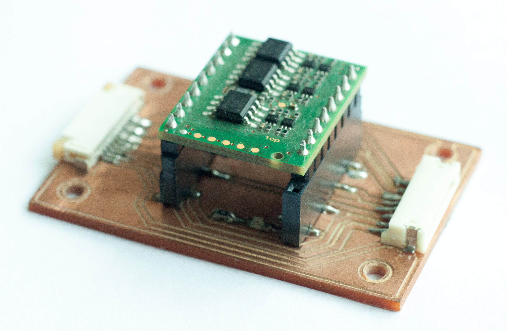
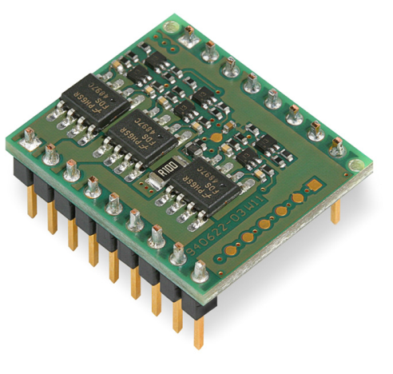
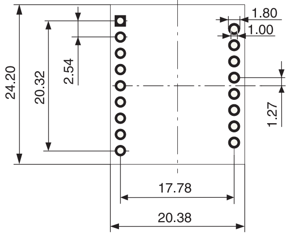
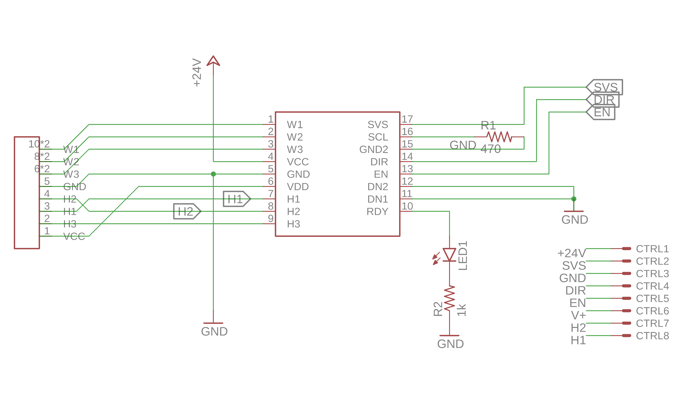
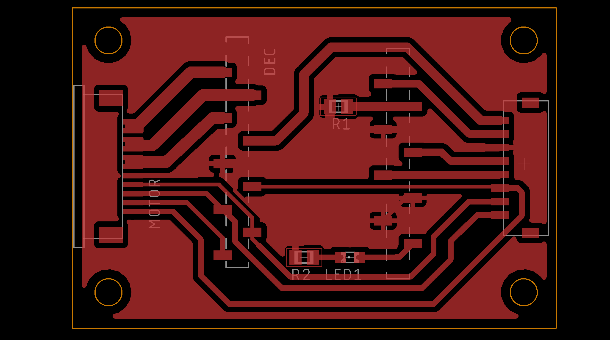
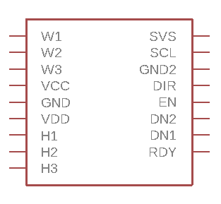
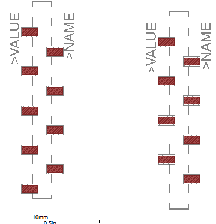
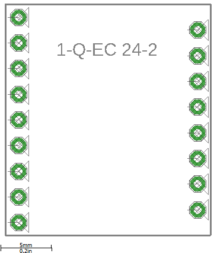

# maxon_bldc_pcb

[![CC BY 4.0][cc-by-shield]][cc-by]

PCB para controlador de motor maxon BLDC 5w

Este circuito fue diseñado como "breakout" para placa Maxon [1-Q-EC DEC module 24/2](https://www.maxongroup.us/maxon/view/news/MEDIENMITTEILUNG-DEC-Module-24-2) para controlar un motor BLDC [EC 20 flat](https://www.maxongroup.com/maxon/view/product/351005) también de maxon.

La necesidad de hacer esta pcb tiene dos orígenes:

1. La disposición de los pines del DEC de maxon no esta pensada para una protoboard, o algo de tamaño estandar, debido a esa diferencia de 1.27mm entre las dos corridas de pines, lo que lo hace innecesariamente compliado para utilizar.

  

2. Es necesario poder controlar el motor y comunicarse con el DEC utilizando un Arduino o cualquier otro microcontrolador por lo que hay que dejar los pines de alimentación del motor y GPIO disponibles.

## Diseño de la PCB

Por ahora, el circuito es el mínimo necesario para hacer funcionar el motor con el controlador. En las versiones posteriores se agregarán elementos de seguridad si es requerido.

El software utlizado para dieseñar la pcb fue [eagle](https://www.autodesk.com/products/eagle/overview) y los arhivos .sch y .brd los puedes encontrar en la carpeta /cad

## Librería de egale

El módulo DEC lo puedes encontrar en mi librería de eagle [robot_hand.lbr](https://github.com/growolff/tesis-pcb/raw/master/my_lbr/robot-hand.lbr) en su versión actualizada con dos footprint, uno para montaje superficial (SMD) y otro para los típicos "through hole".

El footprint para montar el DEC superficialmente lo diseñé luego de encontrar estos maravillosos [headers hembra SMD](https://www.sparkfun.com/products/11543) en el mercado. Como el resto de los componentes de la pcb eran superficiales, ahorré mucho trabajo al  fabricar la placa en el [FabLab](http://fablab.uchile.cl) ya que solo necesité fresar una cara de la placa de cobre.

### Symbol

### Footprints

## Licencia

Esta placa está publicada bajo la licencia [CC-BY-4.0][cc-by]

[![CC BY SA 4.0][cc-by-image]][cc-by]

[cc-by]: https://creativecommons.org/licenses/by/4.0/
[cc-by-image]: https://i.creativecommons.org/l/by/4.0/88x31.png
[cc-by-shield]: https://img.shields.io/badge/License-CC%20BY%204.0-lightgrey.svg
